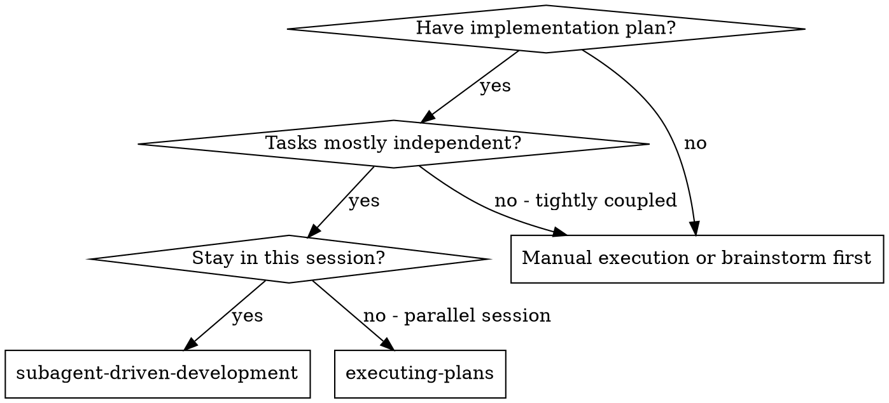
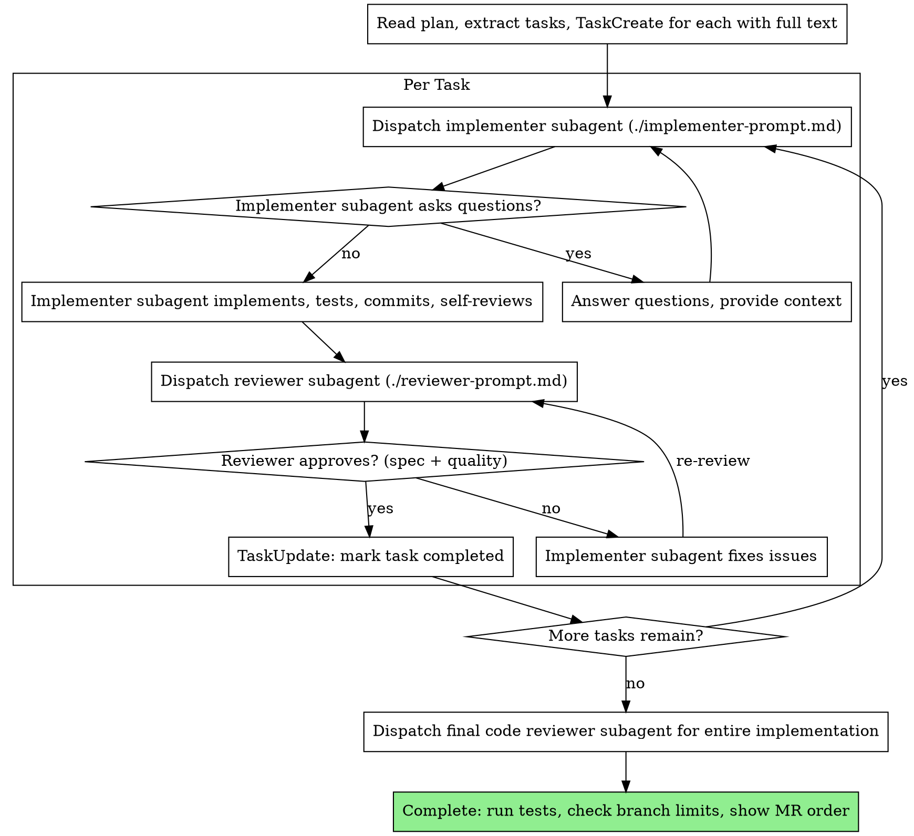

# Subagent-Driven Development

Execute plan by dispatching fresh subagent per task, with a single combined review after each: spec compliance first, then code quality — in one pass.

**Core principle:** Fresh subagent per task + combined review (spec then quality in one pass) = high quality, fast iteration

## Context Guard — Check After Every Task

**After each task is marked completed (before dispatching the next implementer subagent), check context usage.**
If context remaining is **less than 70%**, you MUST:
1. Sync `.tasks.json` to save current progress
2. Run `/handoff` to generate a handoff summary
3. Tell the user: "Context is below 70%. Please clear the session and paste the handoff summary to continue from Task N."
4. STOP — do not dispatch the next subagent until the user confirms the new session is ready

## When to Use



**vs. Executing Plans (parallel session):**
- Same session (no context switch)
- Fresh subagent per task (no context pollution)
- Combined review after each task: spec compliance first, then code quality — in one pass
- Faster iteration (no human-in-loop between tasks)

## The Process



## Prompt Templates

- `./implementer-prompt.md` - Dispatch implementer subagent
- `./reviewer-prompt.md` - Dispatch combined reviewer subagent (spec compliance + code quality, in that order)

**REQUIRED:** Implementer subagents MUST invoke the **flow-unit-tests** skill before writing any tests.

## Example Workflow

```
You: I'm using Subagent-Driven Development to execute this plan.

[Read plan file once: docs/plans/feature-plan.md]
[Extract all 5 tasks with full text and context]
[TaskCreate for each task with full description]

Task 1: Gradle convention plugin configuration

[Get Task 1 text and context (already extracted)]
[Dispatch implementation subagent with full task text + context]

Implementer: "Before I begin - should this plugin be scoped to a single module or added project-level in build-logic?"

You: "Project-level in build-logic, following existing convention plugin structure"

Implementer: "Got it. Implementing now..."
[Later] Implementer:
  - Added convention plugin to build-logic/src/convention
  - Registered in build-logic build.gradle.kts
  - Added tests, 5/5 passing
  - Self-review: Found I missed applying the plugin in the root build file, added it
  - Committed

[Dispatch combined reviewer]
Reviewer: ✅ Approved — spec compliant, code quality acceptable

[Mark Task 1 complete]

Task 2: Recovery modes

[Get Task 2 text and context (already extracted)]
[Dispatch implementation subagent with full task text + context]

Implementer: [No questions, proceeds]
Implementer:
  - Added verify/repair modes
  - 8/8 tests passing
  - Self-review: All good
  - Committed

[Dispatch combined reviewer]
Reviewer: ❌ Issues found:
  [SPEC] Missing: Progress reporting (spec says "report every 100 items")
  [SPEC] Extra: Added --json flag (not requested)
  [QUALITY] Magic number (100) — extract as constant

[Implementer fixes all issues]
Implementer: Removed --json flag, added progress reporting, extracted PROGRESS_INTERVAL constant

[Combined reviewer re-reviews]
Reviewer: ✅ Approved — spec compliant, code quality acceptable

[Mark Task 2 complete]

...

[After all tasks]
[Dispatch final code-reviewer]
Final reviewer: All requirements met, ready to merge

[Run all tests: ./gradlew :composeApp:testDebugUnitTest]
[Check total branch line count across all branches]

Merge request order:
1. feature/my-feature...part_1 → develop
2. feature/my-feature...part_2 → develop (after part_1 is merged)

Done!
```

## Advantages

**vs. Manual execution:**
- Subagents follow TDD naturally
- Fresh context per task (no confusion)
- Parallel-safe (subagents don't interfere)
- Subagent can ask questions (before AND during work)

**vs. Executing Plans:**
- Same session (no handoff)
- Continuous progress (no waiting)
- Review checkpoints automatic

**Efficiency gains:**
- No file reading overhead (controller provides full text)
- Controller curates exactly what context is needed
- Subagent gets complete information upfront
- Questions surfaced before work begins (not after)

**Quality gates:**
- Self-review catches issues before handoff
- Combined review: spec compliance first, then code quality — in one pass
- Review loops ensure fixes actually work
- Spec compliance prevents over/under-building
- Code quality ensures implementation is well-built

**Cost:**
- Subagent invocations: implementer + 1 combined reviewer per task (down from 3)
- Controller does more prep work (extracting all tasks upfront)
- Review loops add iterations
- But catches issues early (cheaper than debugging later)

## Red Flags

**Never:**
- Start implementation on main/master branch without explicit user consent
- Skip the combined reviewer — spec and quality must both be verified every task
- Proceed with unfixed issues
- Dispatch multiple implementation subagents in parallel (conflicts)
- Make subagent read plan file (provide full text instead)
- Skip scene-setting context (subagent needs to understand where task fits)
- Ignore subagent questions (answer before letting them proceed)
- Accept "close enough" on reviewer feedback (issues found = not done)
- Skip review loops (reviewer found issues = implementer fixes = review again)
- Let implementer self-review replace actual review (both are needed)
- Move to next task while reviewer has open issues

**If subagent asks questions:**
- Answer clearly and completely
- Provide additional context if needed
- Don't rush them into implementation

**If reviewer finds issues:**
- Implementer (same subagent) fixes them
- Reviewer reviews again
- Repeat until approved
- Don't skip the re-review

**If subagent fails task:**
- Dispatch fix subagent with specific instructions
- Don't try to fix manually (context pollution)

## Branch Management

Track total lines changed on the current branch after every committed task. **Maximum: 350 lines.**

### Checking line count

```bash
# Count total insertions + deletions vs develop
git diff develop...HEAD --stat | tail -1
# Example output: "15 files changed, 234 insertions(+), 45 deletions(-)"
# Total = insertions + deletions
```

### Rules — after each task is committed

| Total changes | Action |
|---|---|
| ≤ 350 | Continue on current branch |
| 351–450 (exceeded by ≤ 100) | Ask user: "Branch has X lines changed (limit 350). OK to continue without splitting?" |
| > 450 | Split automatically — no prompt |

### Splitting a branch

When a split is needed:

1. The current branch becomes `...part_1` (rename it or note it logically)
2. Create the next branch from current HEAD:
```bash
git checkout -b feature/description...part_2
```
3. Continue remaining tasks on the new branch
4. Increment `part_N` for each subsequent split

### At completion — show MR order

Always display the ordered list of branches at the end, even if only one branch was used:

```
Merge request order:
1. feature/description...part_1 → develop
2. feature/description...part_2 → develop  (merge after part_1)
3. feature/description...part_3 → develop  (merge after part_2)
```

Each part targets `develop` directly — merge them in order.

---

## Task Persistence Sync

After marking each task completed via `TaskUpdate`, update the `.tasks.json` file to stay in sync:

1. Read `<plan-path>.tasks.json`
2. Set the task's `"status"` to `"completed"`
3. Set `"lastUpdated"` to current ISO timestamp
4. Write the file back

This ensures cross-session resume works correctly. Without this, a new session loading `.tasks.json` would see completed tasks as `"pending"`.

## Integration

**Required workflow skills:**
- **Standard git branching** — work on a feature branch, never on main/develop
- **flow-writing-plans** — Creates the plan this skill executes
- **flow-requesting-code-review** — Code review template for reviewer subagents
- **Completion checklist** — run tests (`./gradlew :composeApp:testDebugUnitTest`), check branch line limits, show MR order to user

**Subagents should use:**
- **flow-unit-tests** — Subagents MUST invoke this skill before writing any tests

**Alternative workflow:**
- **flow-executing-plans** — Use for parallel session instead of same-session execution
