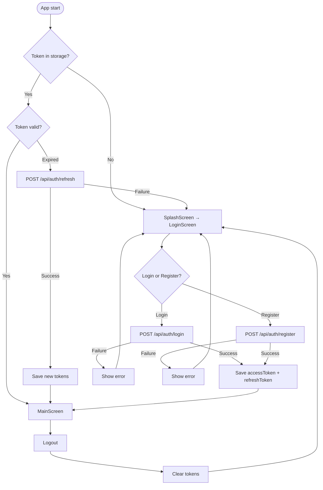
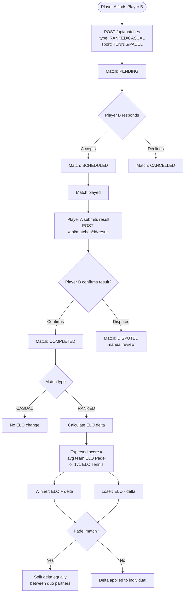
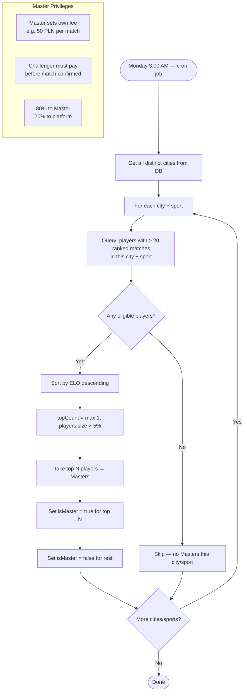
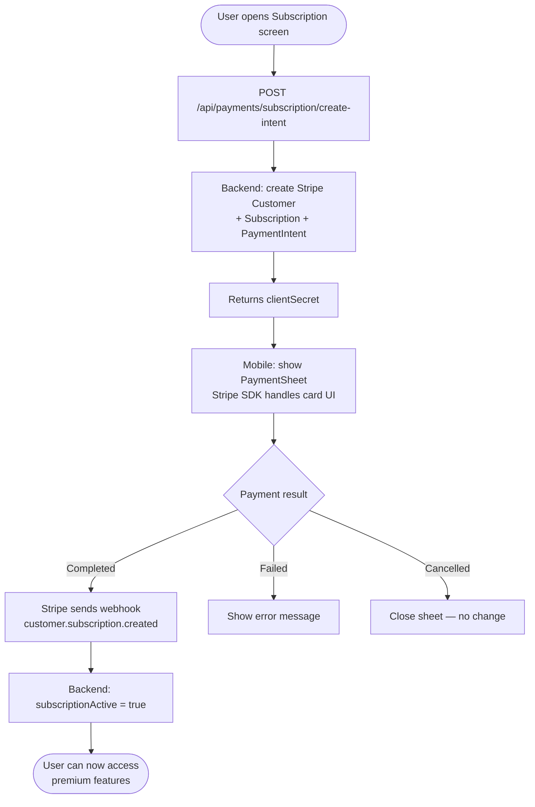
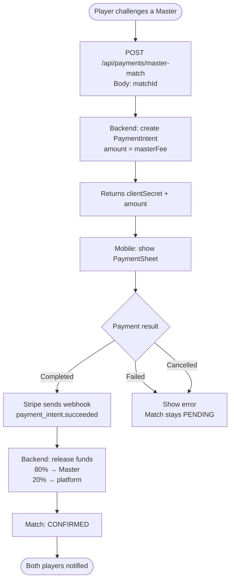
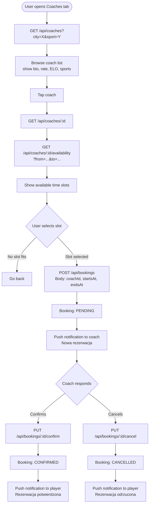
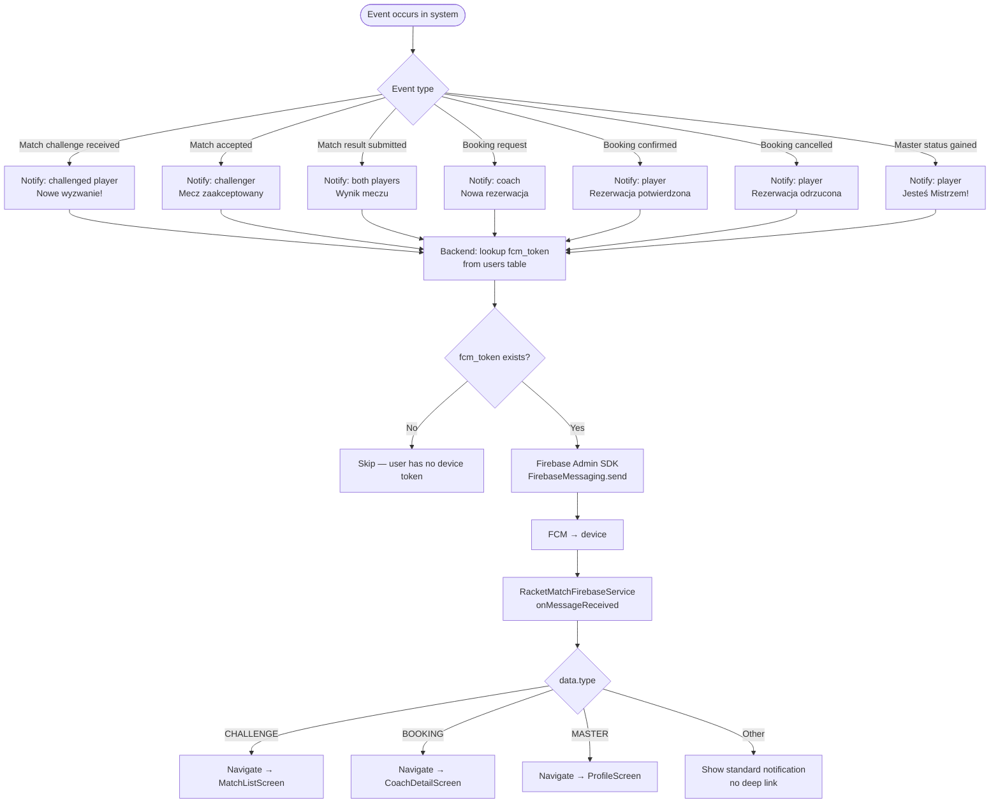

# RacketMatch — Feature Flowcharts

---

## 1. Auth Flow

---

## 2. ELO + Match Flow

---

## 3. Masters System

---

## 4. Stripe Payments

### 4a. Subscription — 10 PLN/month

### 4b. Master Match Payment

---

## 5. Coach Booking

---

## 6. Push Notifications

